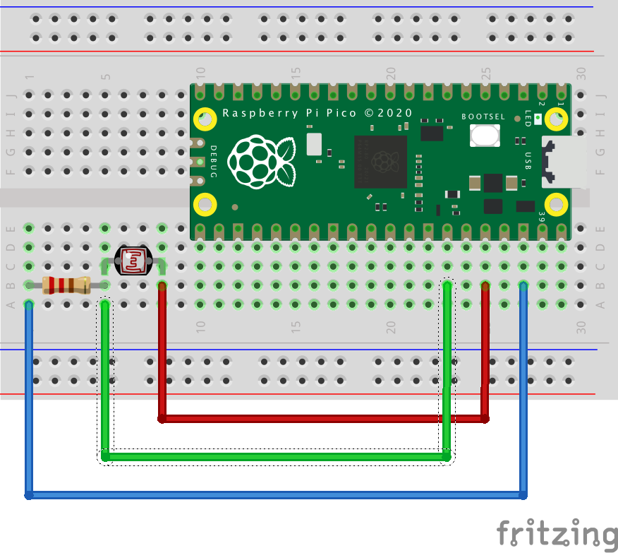

# pico-w-interphone-notify
Raspberry Pi Pico Wと光センサーでインターホンの呼び出し監視を行い、[Ntfy](https://ntfy.sh/)へ通知をする電子工作に利用したコード。

# 環境
CircuitPythonがRaspberry Pi Pico Wにセットアップされている環境を前提としている。

# 材料
- Raspberry Pi Pico W
- 10kΩ抵抗
- CdSセル(5mm)
- ジャンパワイヤ
- ブレッドボード
- ピンヘッダー

# 初期設定
`src/settings.toml`の環境変数を各自の環境に合わせて変更する。  
`src`フォルダー配下すべてをRaspberry Pi Pico Wのルートディレクトリ直下にコピーする。

# 参考
[ラズパイピコと光センサー総額1150円で作る会議室のモニタリングシステム](https://news.mynavi.jp/techplus/article/zeropython-80/)

[Raspberry Pi Pico W日本販売開始！ついに遊べるぞー！](https://akkiesoft.hatenablog.jp/entry/20230329/1680081961)

[Pico W Basic WiFi Test](https://learn.adafruit.com/pico-w-wifi-with-circuitpython/pico-w-basic-wifi-test)